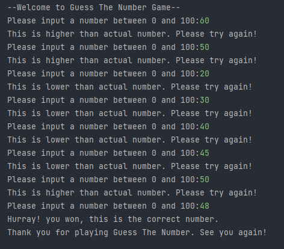

## Guess The Number
Guess The Number Game is a python program i.e, developed in python programming language using random module and some user inputs.

### About the game
- It's a basic python program which stores the random number and iterate it over loop till the number matches the user input.

### How to play?
- Just run the program and enter any numbers between 0 to 100.
- As you guess the correct number you won.

### Setup instructions
1. Install Python 3.x (recommended) from <a href="https://www.python.org/downloads/">here</a>
2. Download this repository as zip and extract.
3. Use Python IDLE or PyCharm to run the program.
4. Run the code and start guessing numbers. 
5. Have fun!!

### Output

