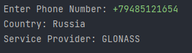
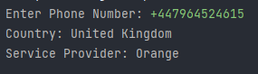

## Phone Number Info
Phone Number Info is a python program i.e, developed in python programming language using phonenumbers module and some user input.

### About the program
- It's a basic python program which takes the user input and fetch Country and the Service Provider of that number from the phonenumbers module using geocoder and carrier.

### How to execute?
- Just run the program and enter any number with the country code.
- Result will be displayed as Country and the Service Provider of that number.


### Setup instructions
1. Install Python 3.x (recommended) from <a href="https://www.python.org/downloads/">here</a>
2. Download this repository as zip and extract.
3. Use PyCharm to run the program.
4. Go to terminal and import the module using the below code
```
pip install phonenumbers
```
5. Run the code and try entering different numbers.

### Output
 
