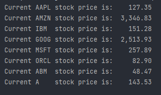

## Realtime-Stock-Price
Current Stock Price is a python program which provides real time stock prices i.e, developed in python programming language using BeautifulSoup and Requests module.

### About the program
- It's a basic python program which fetch the live details of stock prices using webscraping tools such as BeautifulSoup.

### How to execute?
- Just run the program and it will print the real time stock prices.

### Setup instructions
1. Install Python 3.x (recommended) from <a href="https://www.python.org/downloads/">here</a>
2. Download this repository as zip and extract.
3. Use PyCharm to run the program.
4. Go to terminal and import the this 2 modules using the below codes :
```
pip install requests
```
```
pip install bs4
```
5. Run the code.

### Output

